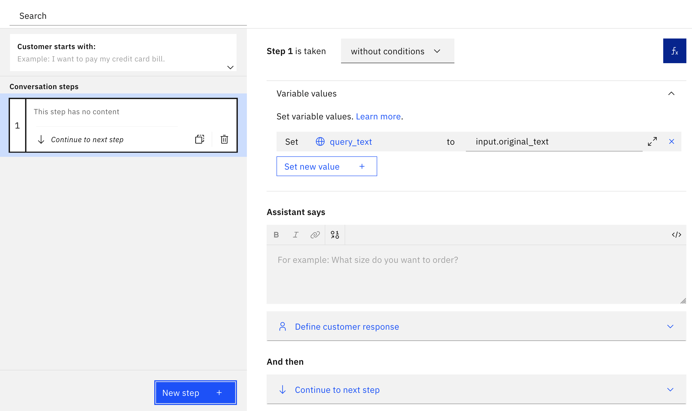
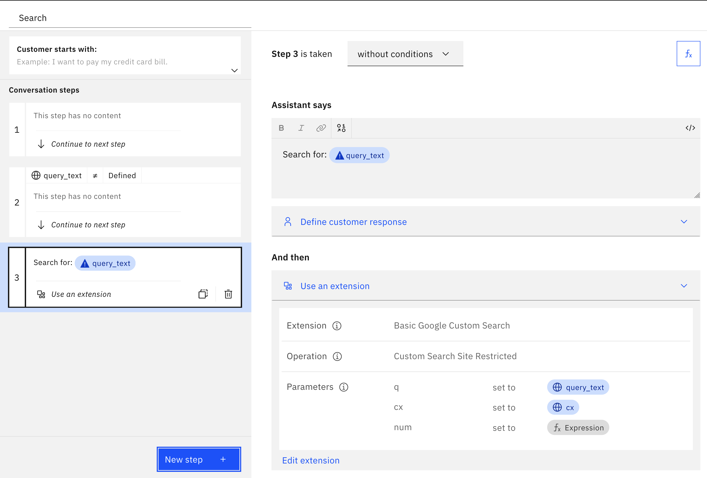
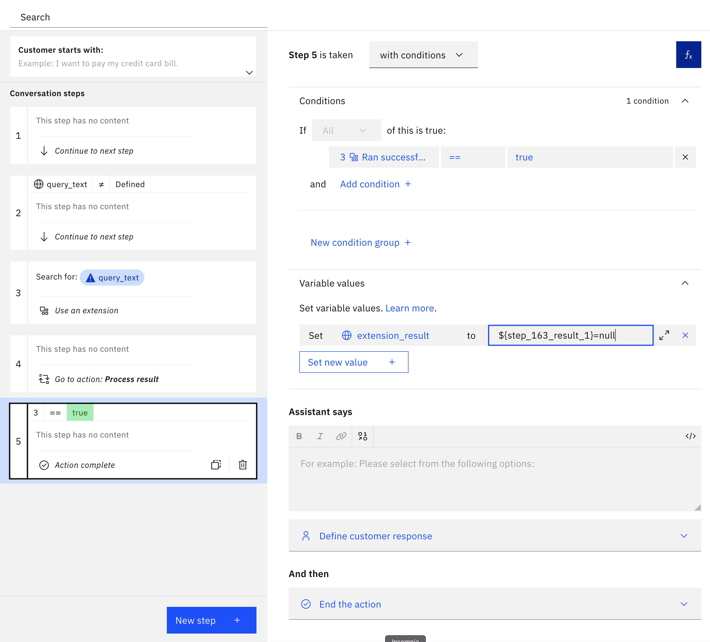

# Google custom search

## Background

This is a starter kit for accessing the Google Custom Search JSON API. This API allows search over a website, collection of websites or the world wide web using the [Google Programmable Search Engine](https://developers.google.com/custom-search/docs/overview), which is a configurable search that allows you to customize search features based on your use-case.

The OpenAPI spec in this starter kit includes the following endpoints:

- `GET /customsearch/v1`: Search for content relevant to a given query over the entire web.
- `GET /customsearch/v1/siterestrict`: Search for content relevant to a given query over a specific collection of websites.

The endpoints are described in detail at:

1. **Custom Search**: https://developers.google.com/custom-search/v1/reference/rest/v1/cse/list
2. **Custom Search Site Restricted**: https://developers.google.com/custom-search/v1/reference/rest/v1/cse.siterestrict/list

These endpoints have the same arguments and responses.  However, there are two major differences between these endpoints:

- The *Custom Search Site Restricted* endpoint is restricted to searching 10 or fewer websites (each of which can have an unlimited number of pages).  In contrast, *Custom Search* can support any number of websites including all of the web that is indexed by Google.
- The *Custom Search* endpoint has a [daily query limit](https://developers.google.com/custom-search/v1/overview#pricing), and the *Custom Search Site Restricted* does not.

For a typical assistant focused on a specific topic, it is usually only necessary to search a single website or a small number of websites.  For assistants of this sort, *Custom Search Site Restricted* is a better fit since it doesn't have a limit on the number of queries that can be run per day.  Assistants that need to search more than 10 websites need to use *Custom Search* instead.

## Pre-Requisite Steps

- Follow the steps listed in the [Before you start](https://developers.google.com/custom-search/v1/introduction#before_you_start) section to create the custom programmable search engine (and thereafter obtain the ID of that Programmable Search Engine) as well as the [API key](https://developers.google.com/custom-search/v1/introduction#identify_your_application_to_google_with_api_key) to identify your application.

## Other Setup Info

### Setup in a new Assistant

If you want to make a _new_ Assistant using this starter kit, take the following steps:

- Download the OpenAPI specification (`google-custom-search-openapi.json`) and Actions JSON file (`google-custom-search-actions.json`) in this starter kit.
- Use (`./basic`) directory for basic search functionality and (`./advanced`) directory for extending the basic search with advanced filtered search.
- Use the OpenAPI specification to [build a custom extension](https://cloud.ibm.com/docs/watson-assistant?topic=watson-assistant-build-custom-extension#building-the-custom-extension).
- [Add the extension to your assistant](https://cloud.ibm.com/docs/watson-assistant?topic=watson-assistant-add-custom-extension) using the API key you obtained in the pre-requisites above.
- [Upload the Actions JSON file](https://cloud.ibm.com/docs/watson-assistant?topic=watson-assistant-admin-backup-restore#backup-restore-import).
- Under "variables"/"set by you" (within the Actions page), set the variable with name `cx` and set to the ID for the programmable search engine that you got in the Pre-Requisite Steps (replacing `0123456789abcdef0`, which is the dummy/placeholder value in the actions file).
- Use either method listed in [Configuring Your Actions Skill to use an Extension](https://github.com/watson-developer-cloud/assistant-toolkit/blob/master/integrations/extensions/README.md#configuring-your-actions-skill-to-use-an-extension) to configure the actions you uploaded to invoke the custom extension you built.
   - In the "Search" action that is included in both the basic and advanced versions, use the following configuration on the step that uses the extension:
      - Click on "Edit extension" at the bottom of the step
      - Select *Custom Search* or *Custom Search Site Restricted* as the endpoint at this step.  See the "Background" section of this document for information about the difference between the two.
      - Set the `query` parameter to the `query_text` session variable.
      - Set the `cx` parameter to the `cx` session variable.
      - Set the `num` parameter to the `num_of_results` session variable (which is set to 3 in the Actions JSON file).
   - If you are using the advanced version, you will also need to configure the "Exclude", "Include", "Date restrict", and "Exact" actions.  For each of these, use all the same configuration you used for the "Search" action (including the `query`, `cx`, and `num` parameter settings) plus one additional parameter setting for each:
      - For "Exclude", set the `excludeTerms` parameter to the `exclude_terms` session variable
      - For "Include", set the `orTerms` parameter to the `include_terms` session variable
      - For "Date restrict", set the `dateRestrict` parameter to the `date_restrict` session variable
      - For "Exact", set the `exactTerms` parameter to the `exact_terms` session variable


### Setup in a pre-existing Assistant

If you want to add this starter kit to an _existing_ assistant, you cannot use the Actions JSON file since it will overwrite your existing configuration.  So instead, follow the following process:

- Download the OpenAPI specification in this starter kit. `basic` directory contains basic search openapi specification, while the `advanced` directory contains the filtered search openapi specification.
- Use the OpenAPI specification to [build a custom extension](https://cloud.ibm.com/docs/watson-assistant?topic=watson-assistant-build-custom-extension#building-the-custom-extension).
- [Add the extension to your assistant](https://cloud.ibm.com/docs/watson-assistant?topic=watson-assistant-add-custom-extension) using the API key you obtained in the pre-requisites step above.
- Create session variables to be used for storing the intermediate results.
- Go to `Variables > Created by you` and add the following:
   - For basic search: `query_text`, `cx`, `extension_result`, `link`, `title`, `snippet`, and `num_of_results`
     - Set the default value for `cx` to the ID for the programmable search engine that you got in the Pre-Requisite Steps
     - Set the default value for `num_of_results` to `3`.
     - Leave the other variables with no default value.     
   - For advanced search with filters: all of the above _plus_ add `exclude_terms`, `include_terms`, `exact_terms`, `date_restrict`, and `number_of_days_old` (all with no default value).

<br>

### Basic
Once this starter kit is properly installed, you can issue a query to your bot and if there is no other action that you've configured that matched that query then it will generate search results for that query.

#### Search
- Create new actions and name them `Search`, `Process Result`, `Show Search Results`, and `Search Result`.
- Open the `Search` action.  Click the fX button to add a variable and add new session variable `query_text` and select "Expression" type and then put `input.original_text` as the expression. As noted in the [documentation for spell checking](https://cloud.ibm.com/docs/assistant?topic=assistant-dialog-runtime-spell-check#dialog-runtime-spell-check-how-it-works), `input.original_text` is set _only_ if the utterance from the user was altered due to spell correction and then it records the original request from the user and not the spell corrected text. Spell correction can be very counter productive for searching because it can take specialized domain vocabulary and "correct" those terms to generic words in the language, so it is often better to apply the search on the original text, as we are doing here.

<br>

- Add step 2, and change "without conditions" to "with conditions" and set the condition `query_text` is not defined. Then set the variable `query_text` to `input.text`. This is needed because the `input.original_text` is only set when spell correction changed the text. When there was no spell correction, you need to use `input.text` instead. After step 2, `query_text` is guaranteed to be the exact original query issued by the user.

<br>

- Add step 3.
  - In "Assistant says", put `Searching for: ${query_text}`.
  - In "And then", select "Use an extension".
    - Select the search extension.
    - Select *Custom Search* or *Custom Search Site Restricted* as the endpoint at this step.  See the "Background" section of this document for information about the difference between the two endpoints.
    - Set the `query` parameter to the `query_text` session variable.
    - Set the `cx` parameter to `cx` session variable you set in pre-requisite step.
    - Set the `num` parameter to `num_of_results` session variable.

<br>

- Add step 4.
   - In "Assistant says" hit `$` and select "Ran Successfully" and then click on `</>` in the upper right of that box to see the full JSON for the response.  In there, you should see a field called `variable` with a value that looks something like `step_123_result_1`.  Copy that value. (Note that you will need to replace `step_123_result_1` in the remaining instructions below with the actual variable name in your environment).
   - Click "abc" in the upper right and delete the variable in "Assistant says" (we only put it there to copy the variable name).
   - Click on "Variable values" and set `extension_result` to `${step_123_result_1}`. This allows you to pass the search results to action that displays them.
   - Click on "And then" and select "Go to another action" and select the `Process Result` action

<br>

- Add step 5.  
  - Change "without conditions" to "with conditions", and set "Ran successfully" to "true"
  - Set the `extension_result` variable to the expression `${step_123_result_1} = null`
  - Set "And then" to "End the action".
  - This step clears the search results to help prevent exceeding [session state size limitations](https://github.com/watson-developer-cloud/assistant-toolkit/tree/master/integrations/extensions/starter-kits/watson-discovery#limit-on-size-of-search-results).

<br>

#### Process Result
- Open the `Process Result` action.
- change "without conditions" to "with conditions" and "check if  or `extension_result is not defined`  or `extension_result.success==false`.
- In "Assistant says" provide failure response "Sorry search failed! Please try again".
- Add new step for checking `extension_result.body == null` or `extension_result.body.items == null` or `extension_result.body.items.size == 0`
- In "Assistant says" provide failure response "Search results are empty".
- Add new step for the success response if results are not empty.
- Change "without conditions" to "with conditions" and "check if `extension_result.success==true` and In "And then" section select "Go to another action" and type "Show Search Results" which we will create in further sections.
  <br>

#### Show Search Results
- Open the `Show Search Results` action.
- In following steps, Iterate over each search results and check if it exists, For example if we would like to show 3 results then there will be 3 more steps.
- Next step, Change without conditions to "with conditions" and check if `${extension_result.body.items}.size>0` then
  - Click fx and change variable value `search_result` to expression `${extension_result.body.items}.get(0)`
- Next step, Change without conditions to "with conditions" and check if `${extension_result.body.items}.size>1` then
  - Click fx and change variable value `search_result` to expression `${extension_result.body.items}.get(1)`
- Next step, Change without conditions to "with conditions" and check if `${extension_result.body.items}.size>2` then
  - Click fx and change variable value `search_result` to expression `${extension_result.body.items}.get(2)`
  <br>

#### Search Result
- Open the `Search Result` action.
- Add a "New Step", then:
  - Click the fX button to set session variables as below:
```
link = ${search_result}.link
title = ${search_result}.title
snippet = ${search_result}.htmlSnippet
```

- Add the following to the "Assistant says":

```
<a href="${link}" target="_blank">${title}</a>
${snippet}
```

<br>

#### Link Actions to No Action matches state
- Close the action editor (by clicking X in the upper right)
- Go to "Actions" > "Set by assistant" > "No action matches" and remove all the steps from the action.  Add in a new step.  Under "And then" select "Go to another action" and select "Search" and click "End this action after the subaction is completed".
- You may also want to go to "Actions" > "Set by assistant" > "Fallback" and do the same thing as in the previous step.  Note, however, that this will prevent your assistant from escalating to a human agent when a customer asks to connect to a human agent (which is part of the default behavior for "Fallback") so only do this if you do not have your bot connected to a human agent chat service.  For more details on connecting to human agents within Watson Assistant see [our documentation](https://cloud.ibm.com/docs/watson-assistant?topic=watson-assistant-human-agent) and [blog post](https://medium.com/ibm-watson/bring-your-own-service-desk-to-watson-assistant-b39bc920075c).
- Go to the all action and remove everything from the "Customer starts with" list so that the action _only_ triggers via the "Go to another action" settings.  If you skip this, then some action will also be considered by the intent recognizer as a possible intent, which adds unnecessary complexity to the intent recognition and thus could result in lower overall intent recognition accuracy.


### Advanced
#### Filtered Search
Once you have the basic search setup, you can setup a filtered search to scope the results on query parameters.
- Google custom search api provide list of customizable query parameters that can scope the results based on the parameters.
- Create new action for each kind of filter
  - Date restrict
    - Create new action and name it `Date restrict`
    - Add new step, with Assistant says "Please provide the number of days old required?"
    - In second step, store the user provided number of days in session variable `number_of_days_old` and set `date_restrict` variable value to `d[${number_of_days_old}]`, Call the extension with the parameters `query_text` for `q`, `cx` for `cx` and `date_restrict` for `dateRestrict` query parameter and `num` parameter to `num_of_results` session variable.
    - In third step, store the result in session variable `extension_result` and redirect to action `Process result`.
  - Include terms
    - Create new action and name it `Include terms`
    - Add new step, with Assistant says "Please provide the terms to include (comma separated)?"
    - In second step, store the user provided number of days in session variable `include_terms`, Call the extension with the parameters `query_text` for `q`, `cx` for `cx` and `include_terms` for `orTerms` query parameter and `num` parameter to `num_of_results` session variable.
    - In third step, store the result in session variable `extension_result` and redirect to action `Process result`.
  - Exclude terms
    - Create new action and name it `Exclude terms`
    - Add new step, with Assistant says "Please provide the terms to exclude (comma separated)?"
    - In second step, store the user provided number of days in session variable `exclude_terms`, Call the extension with the parameters `query_text` for `q`, `cx` for `cx` and `exclude_terms` for `excludeTerms` query parameter and `num` parameter to `num_of_results` session variable.
    - In third step, store the result in session variable `extension_result` and redirect to action `Process result`.
  - Exact terms
    - Create new action and name it `Exact terms`
    - Add new step, with Assistant says "Please provide the terms to exclude (comma separated)?"
    - In second step, store the user provided number of days in session variable `exact_terms`, Call the extension with the parameters `query_text` for `q`, `cx` for `cx` and `exact_terms` for `exactTerms` query parameter and `num` parameter to `num_of_results` session variable.
    - In third step, store the result in session variable `extension_result` and redirect to action `Process result`.
  <br>
- Create new action and name it `Filtered Search`
  - Add new step where assistant says "Would you like to filter your search results based on parameters?" and user response should be one of the options `Date restrict`,`Include terms`,`Exclude terms`,`Exact terms`.
  - Create new step for each option and with condition set for each option. Redirect to action based on the condition for user response. For example, If user response is `Exact terms` then "Go to another action" will point to `Exact terms` action.
  - Please note the filtered search uses the same query input stored in `query_text` during the basic search setup. It just decorates the request with additional parameters for filtering.
- Add extra step to the `Search` action that calls `Filtered Search`.
- You may also want to clear search results to help prevent exceeding result size limitations at the end of each of the filter search actions in the same way that we did for the `Search` action too.  This reduces the risk that your assistant will run out of memory in later actions because it stores so much data during the filtered search.

## Using this Starter Kit

Once this starter kit is properly installed, you can issue a query to your bot. If there is no other action that you've configured that matched that query then it will generate search results for that query.  Here is an example of what search results from the "Search" action can look like:


If you are using the advanced filtered search actions, whenever a search is performed, the user gets a list of options for whether and how to filter the search results.  The user can select a filter to apply ("Exclude terms", "Include terms", "Exact terms", "Dated") or can select "End" to complete the search action.  The search action continues to ask for more filters until the user selects "End" to terminate the action.  This can be a somewhat tedious user experience (especially the requirement to select "End" to terminate the action).  However, it is included in this kit as an illustrative example of how you can give your end users control over what filters to apply to narrow down their search results.  We recommend that you take inspiration from this example and then craft an experience that meets the needs of your users.

Feel free to contribute to this starter kit, or add other starter kits by following these [contribution guidelines](../../docs/CONTRIBUTING.md).
