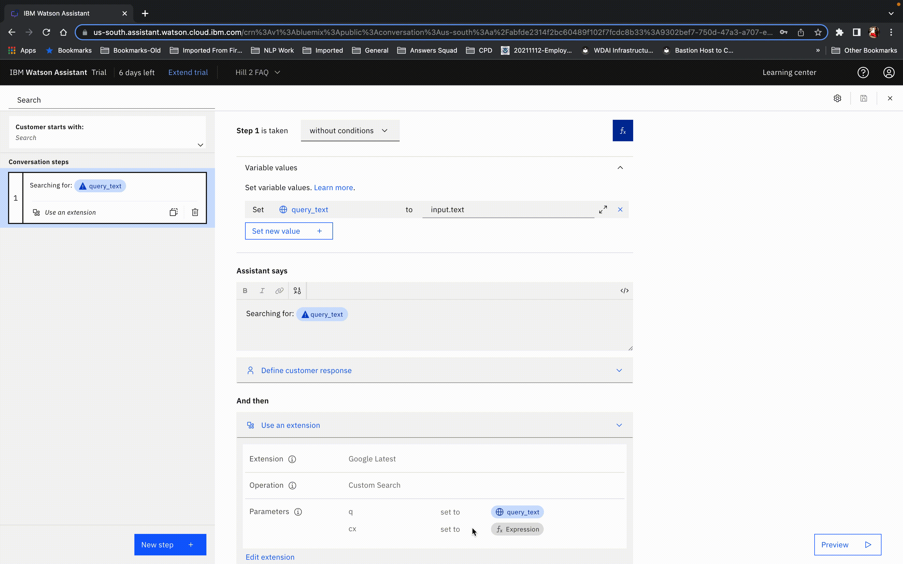
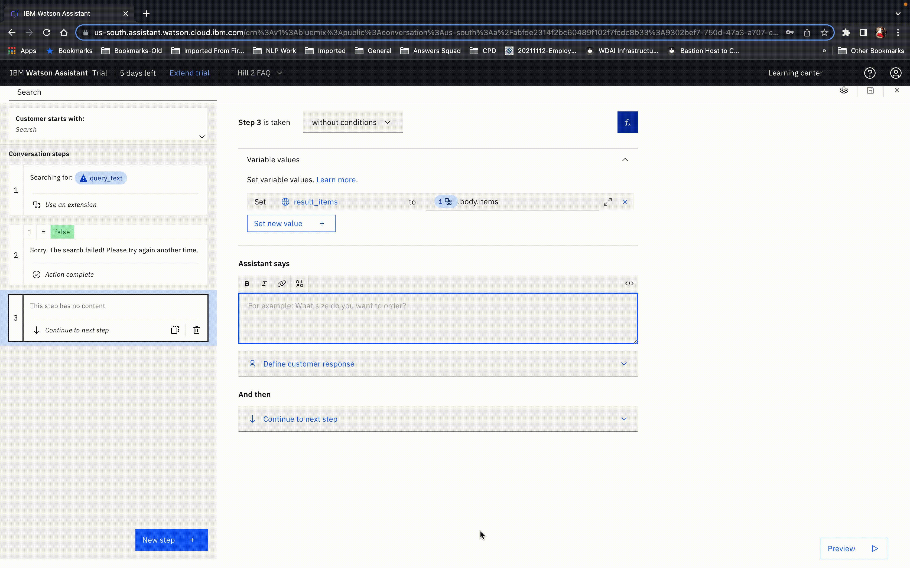
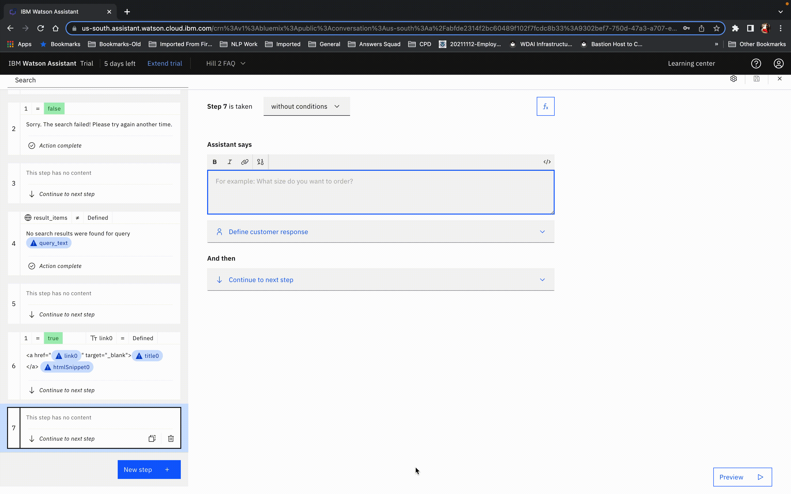
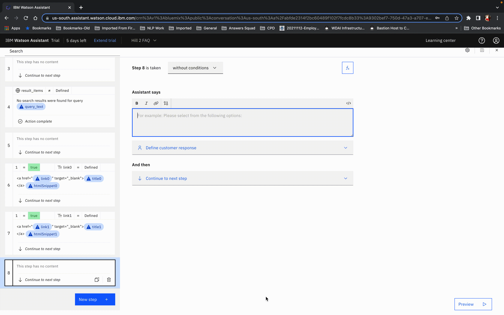

# Google custom search

## Background

This is a starter kit for accessing the Google "Custom Search" JSON API. The "Custom Search" API allows search over a website, collection of websites or the world wide web using the [Google Programmable Search Engine](https://developers.google.com/custom-search/docs/overview) which is a configurable search that allows you to customize search features based on your use-case.

The OpenAPI spec in this starter kit includes the following endpoint:

- `GET /customsearch/v1`: Search for content relevant to a given query over the entire web.
- `GET /customsearch/v1/siterestrict`: Search for content relevant to a given query over a specific collection of websites.

The endpoints are described in detail at:
 
1. **Custom Search**: https://developers.google.com/custom-search/v1/reference/rest/v1/cse/list 
2. **Custom Search Site Restricted**: https://developers.google.com/custom-search/v1/reference/rest/v1/cse.siterestrict/list

The Site Restricted API is similar to the Custom Search JSON API except that it has no daily query [limit](https://developers.google.com/custom-search/v1/overview#pricing).

This starter kit exposes only the minimal functionality needed for simple use cases, and you will need to extend it if you want to cover more advanced ones.  For example, the API has parameters for restricting search based on the date or country that are not listed in the simple OpenAPI specification provided in the starter kit, so you would need to add these if you wanted to employ such filters.

## Pre-Requisite Steps

Follow the steps listed in the [Before you start](https://developers.google.com/custom-search/v1/introduction#before_you_start) section to create the custom programmable search engine as well as the API key to identify your application

## Other Setup Info

### Setup in a new Assistant

If you want to make a _new_ Assistant using this starter kit, take the following steps:

- Download the OpenAPI specification (`google-custom-search-openapi.json`) and Actions JSON file (`google-custom-search-actions.json`) in this starter kit.
- Use the OpenAPI specification to [build a custom extension](https://cloud.ibm.com/docs/watson-assistant?topic=watson-assistant-build-custom-extension#building-the-custom-extension).
- [Add the extension to your assistant](https://cloud.ibm.com/docs/watson-assistant?topic=watson-assistant-add-custom-extension) using the API key you obtained in the pre-requisites above.
- [Upload the Actions JSON file](https://cloud.ibm.com/docs/watson-assistant?topic=watson-assistant-admin-backup-restore#backup-restore-import).
- Use either method listed in [Configuring Your Actions Skill to use an Extension](https://github.com/watson-developer-cloud/assistant-toolkit/blob/master/integrations/extensions/README.md#configuring-your-actions-skill-to-use-an-extension) to configure the actions you uploaded to invoke the custom extension you built.

### Setup in a pre-existing Assistant

If you want to add this starter kit to an _existing_ assistant, you cannot use the Actions JSON file since it will overwrite your existing configuration.  So instead, follow the following process:

- Download the OpenAPI specification in this starter kit.
- Use the OpenAPI specification to [build a custom extension](https://cloud.ibm.com/docs/watson-assistant?topic=watson-assistant-build-custom-extension#building-the-custom-extension).
- [Add the extension to your assistant](https://cloud.ibm.com/docs/watson-assistant?topic=watson-assistant-add-custom-extension) using the API key you obtained in the first step above.
- Go to `Variables > Created by you` and add `query_text`, `result_items` `link0`, `link1`, `link2`, `title0`, `title1`, `title2`, `snippet0`,`snippet1`, and `snippet2`.
- Create a new action and put "Search" in "What does your customer say to start this interaction?".  Add step 1:
  - Click the fX button to add a variable and add new session variable `query_text` and select "Expression" type and then put `input.text` or `input.original_text` as the expression.  The former will employ spelling correction to fix any detected spelling errors before sending the query, which can be helpful but it can also be counterproductive if your documents include specialized terminology that is not in our dictionary (such as product names).  On the other hand, we've seen some undiagnosed reliability issues with `input.original_text` so be sure to test carefully if you use `input.original_text` and consider switching to `input.text` if you find that the `query_text` variable is not being set correctly (which will be easy to detect if you complete the next step).
  - Optional: In "Assistant says", put `Searching for: ${query_text}`
  - In "And then", select "Use an extension", select the extension you made back in step 2, and select the search endpoint and set the `query` parameter to the `query_text` session variable and the `cx` parameter to an *Expression* setting the value to the `Programmable Search Engine ID` you obtained during the pre-requisites step

<br>

- Click "New Step" and change "without conditions" to "with conditions" and select "Ran successfully" is "false".  Also set "And then" to "End the action".  Then add the following to the "Assistant says":
Sorry.  The search failed!  Please try again another time.

<br>

- Still in the "Search" action, add a "New Step".  In the new step:
  - In "Assistant says" hit `$` and select "Ran Successfully" and then click on `</>` in the upper right of that box to see the full JSON for the response.  In there, you should see a field called `variable` with a value that looks something like `step_123_result_1`.  Copy that value.
  - Click "abc" in the upper right and delete the variable in "Assistant says" (we only put it there to copy the variable name).
  - Click the fX button to add variables and set the `result_items` variable to an `Expression`. Type in the following replacing `step_123_result_1` with the actual variable name:
  ```
  result_items = ${step_123_result_1}.body.items
  ```
<br>
 
- Click "New step" and change "without conditions" to "with conditions" and select `result_items` is not "defined". Then add the following to the "Assistant says":
No search results were found for query "${query_text}" 
Next, under "And then" select "End the action"

<br>

- Add a "New Step", then:
  - Change "without conditions" to "with conditions" and select "true" for "Ran successfully"
  - Click the fX button to add variables and add all of the following new session variables, replacing `step_123_result_1` with the actual variable name and selecting "Expression" each time. For context on why we do this and what these mean, see [Extensions Made Easy with Watson Assistant Starter Kits](https://medium.com/ibm-watson/extensions-made-easy-with-watson-assistant-starter-kits-6b177f624697):
```
link0 = ${step_123_result_1}.body.items.get(0).link
title0 = ${step_123_result_1}.body.items.get(0).title
snippet0 = ${step_123_result_1}.body.items.get(0).htmlSnippet
link1 = ${step_123_result_1}.body.items.get(1).link
title1 = ${step_123_result_1}.body.items.get(1).title
snippet1 = ${step_123_result_1}.body.items.get(1).htmlSnippet
link2 = ${step_123_result_1}.body.items.get(2).link
title2 = ${step_123_result_1}.body.items.get(2).title
snippet2 = ${step_123_result_1}.body.items.get(2). htmlSnippet
```

<br>

- Click "New Step" and also change "without conditions" to "with conditions" and select "Ran successfully" is "true" and "link0" is "defined".  Then add the following to the "Assistant says":

```
<a href="${link0}" target="_blank">${title0}</a>
${snippet0}
```

<br>

- Click "New Step" and change "without conditions" to "with conditions" and select "Ran successfully" is "true" and "link1" is "defined".  Then add the following to the "Assistant says":

```
<a href="${link1}" target="_blank">${title1}</a>
${snippet1}
```

<br>

- Click "New Step" and change "without conditions" to "with conditions" and select select "Ran successfully" is "true" and "link2" is "defined".  For this step, set "And then" to "End the action".  Then add the following to the "Assistant says":

```
<a href="${link2}" target="_blank">${title2}</a>
${snippet2}
```

<br>

- Close the action editor (by clicking X in the upper right)
- Go to "Actions" > "Set by assistant" > "No action matches" and remove all the steps from the action.  Add in a new step.  Under "And then" select "Go to another action" and select "Search" and click "End this action after the subaction is completed".
- You may also want to go to "Actions" > "Set by assistant" > "Fallback" and do the same thing as in the previous step.  Note, however, that this will prevent your assistant from escalating to a human agent when a customer asks to connect to a human agent (which is part of the default behavior for "Fallback") so only do this if you do not have your bot connected to a human agent chat service.  For more details on connecting to human agents within Watson Assistant see [our documentation](https://cloud.ibm.com/docs/watson-assistant?topic=watson-assistant-human-agent) and [blog post](https://medium.com/ibm-watson/bring-your-own-service-desk-to-watson-assistant-b39bc920075c).
- Go to the Search action and remove "Search" from the "Customer starts with" list so that the search action _only_ triggers via the "Go to another action" settings described in steps 13-15 above.  If you skip this, then the "Search" action will also be considered by the intent recognizer as a possible intent, which adds unnecessary complexity to the intent recognition and thus could result in lower overall intent recognition accuracy.

## Using this Starter Kit

Once this starter kit is properly installed, you can issue a query to your bot and if there is no other action that you've configured that matched that query then it will generate search results for that query.
