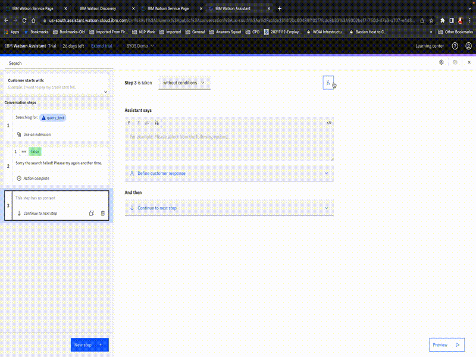
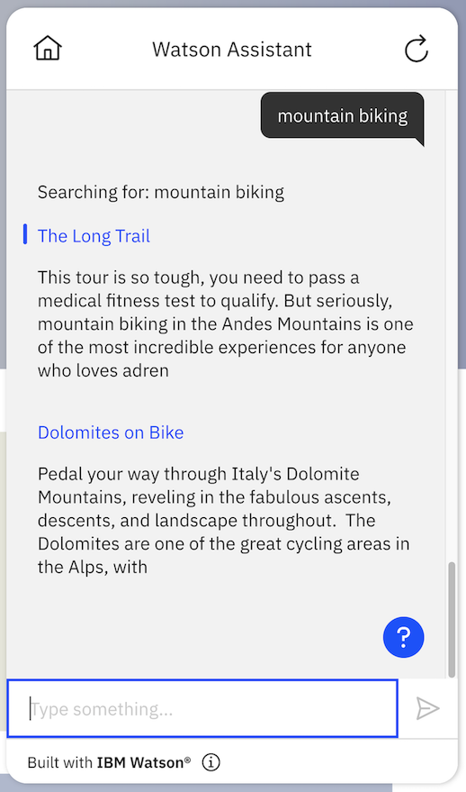

# Magnolia Search

## Background

This is a starter kit for accessing the Magnolia Delivery API. The ["Delivery" API](https://docs.magnolia-cms.com/product-docs/6.2/Developing/API/Delivery-API.html) allows search over the content that the user has authored into their content store.

The OpenAPI spec in this starter kit includes the following **example** endpoint:

- `GET /delivery/tours/v1`: Search for content in the tours workspace using the v1 version of the REST endpoint

### Important Notes

1. This is an **example endpoint only** and was setup as a custom REST endpoint in the sample demo instance of Magnolia. As an end user, you should make sure to replace this with the path of your endpoint which will get invoked like `/.rest/<endpoint>/`. See the note [here](https://docs.magnolia-cms.com/product-docs/6.2/Developing/API/Delivery-API.html#_methods) for more details. Using `delivery` as a part of your end point path will allow you to have anonymous users access the `/.rest/delivery/*` path however it is recommended to have a security strategy to safeguard your content.
2. The Delivery endpoint for querying nodes is described in detail in the [Magnolia docs](https://docs.magnolia-cms.com/product-docs/6.2/Developing/API/Delivery-API.html#_query_nodes). Note that the `query nodes` method is the functionality that allows a user to perform ***full-text searches*** on the content stored in their instance of Magnolia. Since the endpoint does not support natural language queries, you would need to ensure that an end user is only performing strict keyword queries or you could potentially have those natural language queries stripped down to simple keyword queries by taking the help of [IBM Cloud Functions](https://www.ibm.com/cloud/functions) to remove stopwords and lemmatize other words.

This starter kit exposes only the minimal functionality needed for simple use cases, and you will need to extend it if you want to cover more advanced ones.  For example, the API has parameters for restricting search based on the date or country that are not listed in the simple OpenAPI specification provided in the starter kit, so you would need to add these if you wanted to employ such filters.

## Pre-Requisite Steps

If you don't have a Delivery endpoint already setup to use with your Magnolia instance, make sure to follow the [Getting Started docs](https://docs.magnolia-cms.com/product-docs/6.2/Getting-started-with-Magnolia/Getting-started-with-REST.html) to setup one that allows you to get content from a certain workspace node.

Since there is no security enabled by default on the REST endpoint, you should make sure to follow steps outlined in the [REST security](https://docs.magnolia-cms.com/product-docs/6.2/Modules/List-of-modules/REST-module/REST-security.html) section to provide restricted access to the endpoint only for an authorized user via their corresponding username/password.

## Other Setup Info

### Setup in a new Assistant

If you want to make a _new_ Assistant using this starter kit, take the following steps:

- Download the OpenAPI specification (`magnolia-search-openapi.json`) and Actions JSON file (`magnolia-search-actions.json`) in this starter kit.
- Update the API path from `/delivery/tours/v1` to the endpoint setup by you for your Magnolia instance in the downloaded `magnolia-search-openapi.json`
- Use the OpenAPI specification to [build a custom extension](https://cloud.ibm.com/docs/watson-assistant?topic=watson-assistant-build-custom-extension#building-the-custom-extension).
- [Add the extension to your assistant](https://cloud.ibm.com/docs/watson-assistant?topic=watson-assistant-add-custom-extension) using the username/password you setup for the API in the pre-requisites above. Also fill in the domain of your public Magnolia instance into the `domain` server variable.
- [Upload the Actions JSON file](https://cloud.ibm.com/docs/watson-assistant?topic=watson-assistant-admin-backup-restore#backup-restore-import).
- Use either method listed in [Configuring Your Actions Skill to use an Extension](https://github.com/watson-developer-cloud/assistant-toolkit/blob/master/integrations/extensions/README.md#configuring-your-actions-skill-to-use-an-extension) to configure the actions you uploaded to invoke the custom extension you built. Set the `q` parameter to the `query_text` session variable
- In the Actions page go to `Variables > Created by you` and update the `workspace` variable to be the URL of the workspace that you have set up your REST endpoint for. Example: We use `http://34.71.156.142:8080/magnoliaPublic/tours` since the Delivery endpoint setup to test this starter kit is querying the ***tours*** workspace


### Setup in a pre-existing Assistant

If you want to add this starter kit to an _existing_ assistant, you cannot use the Actions JSON file since it will overwrite your existing configuration.  So instead, follow the following process:

- Download the OpenAPI specification in this starter kit.
- Update the API path from `/delivery/tours/v1` to the endpoint setup by you for your Magnolia instance in the downloaded `magnolia-search-openapi.json`
- Use the OpenAPI specification to [build a custom extension](https://cloud.ibm.com/docs/watson-assistant?topic=watson-assistant-build-custom-extension#building-the-custom-extension).
- [Add the extension to your assistant](https://cloud.ibm.com/docs/watson-assistant?topic=watson-assistant-add-custom-extension) using the username/password you setup for the API in the pre-requisites above.
- Go to `Variables > Created by you` and add `query_text`, `search_results`, `search_result`, `title`, `link`, `snippet`, `path` and `workspace`.
- Update the `workspace` variable to be the URL of the workspace that you have set up your REST endpoint for. Example: We use `http://34.71.156.142:8080/magnoliaPublic/tours` since the Delivery endpoint setup for this starter kit is querying the ***tours*** workspace
- Create a new action and put "Show Search Result" in "What does your customer say to start this interaction?". Add step 1:
  - Click the fX button to add variables and add all of the following new session variables.For context on why we do this and what these mean, see [Extensions Made Easy with IBM watsonx Assistant Starter Kits](https://medium.com/ibm-watson/extensions-made-easy-with-watson-assistant-starter-kits-6b177f624697):

		```
		title = ${search_result}.name
		snippet = ${search_result}.body.substring(0,200)
		path = ${search_result}.get("@path")
		link = ${workspace}.append(${path}).append(".html")
		```

  -  Then add the following to the "Assistant says":

		```
		<a href="${link}" target="_blank">${title}</a>
		${snippet}
		```
<br>

- Create a new action and put "Show Search Results" in "What does your customer say to start this interaction?".  Add step 1:
  - Change "without conditions" to "with conditions", click on "Expression" in the condition drop-down and type in `${search_results}.size < 1`
  - Then add the following to the "Assistant says":
  I was not able to find anything relevant to your query, sorry!
  - In "And then", select "End the action"

 <br>

- Still in the "Show Search Results" action, add a "New Step".
  - Change "without conditions" to "with conditions", click on "Expression" in the condition drop-down and type in `${search_results}.size > 0`
  - Click on the fX button and set variable `search_result` to `${search_results}.get(0)`
  - In "And then", select "Go to another action" and select the action "Show Search Result"
- Still in the "Show Search Results" action, add a "New Step".
  - Change "without conditions" to "with conditions", click on "Expression" in the condition drop-down and type in `${search_results}.size > 1`
  - Click on the fX button and set variable `search_result` to `${search_results}.get(1)`
  - In "And then", select "Go to another action" and select the action "Show Search Result"
- Still in the "Show Search Results" action, add a "New Step".
  - Change "without conditions" to "with conditions", click on "Expression" in the condition drop-down and type in `${search_results}.size > 2`
  - Click on the fX button and set variable `search_result` to `${search_results}.get(2)`
  - In "And then", select "Go to another action" and select the action "Show Search Result"


- Create a new action and put "Search" in "What does your customer say to start this interaction?".  Add step 1:
- Click on the `Search` action and put "Search" in "What does your customer say to start this interaction?".  Add step 1:
    - Click the fX button to add a variable and add new session variable `query_text` and select "Expression" type and then put `input.original_text` as the expression. As noted in the [documentation for spell checking](https://cloud.ibm.com/docs/assistant?topic=assistant-dialog-runtime-spell-check#dialog-runtime-spell-check-how-it-works), `input.original_text` is set _only_ if the utterance from the user was altered due to spell correction and then it records the original request from the user and not the spell corrected text. Spell correction can be very counter productive for searching because it can take specialized domain vocabulary and "correct" those terms to generic words in the language, so it is often better to apply the search on the original text, as we are doing here.

<br>

    - Add step 2, and change "without conditions" to "with conditions" and set the condition `query_text` is not defined. Then set the variable `query_text` to `input.text`. This is needed because the `input.original_text` is only set when spell correction changed the text. When there was no spell correction, you need to use `input.text` instead. After step 2, `query_text` is guaranteed to be the exact original query issued by the user.

<br>

    - Add step 3 to run the search on the query using your extension. In "Assistant says", put `Searching for: ${query_text}`. In "And then", select "Use an extension", select your Magnolia extension, select your search endpoint, and set the `q` parameter to the `query_text` session variable.

<br>

- Click "New Step" and change "without conditions" to "with conditions" and select "Ran successfully" is "false".  Also set "And then" to "End the action".  Then add the following to the "Assistant says":
Sorry.  The search failed!  Please try again another time.

<br>

- Still in the "Search" action, add a "New Step".  In the new step:
  - In "Assistant says" hit `$` and select "Ran Successfully" and then click on `</>` in the upper right of that box to see the full JSON for the response.  In there, you should see a field called `variable` with a value that looks something like `step_123_result_1`.  Copy that value.
  - Click "abc" in the upper right and delete the variable in "Assistant says" (we only put it there to copy the variable name).
  - Click the fX button to add variables and set the `search_results` variable to an `Expression`. Type in the following replacing `step_123_result_1` with the actual variable name:

	  ```
	  search_results = ${step_123_result_1}.body.results
	  ```

<br>

  - In "And then", select "Go to another action", and select the action "Show Search Results"


- Close the action editor (by clicking X in the upper right)
- Go to "Actions" > "Set by assistant" > "No action matches" and remove all the steps from the action.  Add in a new step.  Under "And then" select "Go to another action" and select "Search" and click "End this action after the subaction is completed".
- You may also want to go to "Actions" > "Set by assistant" > "Fallback" and do the same thing as in the previous step.  Note, however, that this will prevent your assistant from escalating to a human agent when a customer asks to connect to a human agent (which is part of the default behavior for "Fallback") so only do this if you do not have your bot connected to a human agent chat service.  For more details on connecting to human agents within IBM watsonx Assistant see [our documentation](https://cloud.ibm.com/docs/watson-assistant?topic=watson-assistant-human-agent) and [blog post](https://medium.com/ibm-watson/bring-your-own-service-desk-to-watson-assistant-b39bc920075c).
- Go to the Search action and remove "Search" from the "Customer starts with" list so that the search action _only_ triggers via the "Go to another action" settings described in steps 13-15 above.  If you skip this, then all actions will also be considered by the intent recognizer as a possible intent, which adds unnecessary complexity to the intent recognition and thus could result in lower overall intent recognition accuracy.
- Do the same as above for removing "Show Search Results" and "Show Search Result" from the corresponding actions' "Customer starts with" list

## Using this Starter Kit

Once this starter kit is properly installed, you can issue a query to your bot and if there is no other action that you've configured that matched that query then it will generate search results for that query.

<br>

Feel free to contribute to this starter kit, or add other starter kits by following these [contribution guidelines](../../docs/CONTRIBUTING.md).
