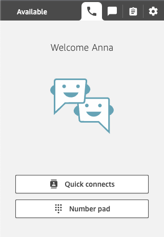

# Contact Control Panel (CCP) example

These instructions provide an example of how to build a custom contact control panel (CCP) that grabs the data from an Amazon Connect flow and uses it to display the conversation history with Watson Assistant. It can be used as a reference for more complex and customer-specific use cases.

The example used in these instructions is based on this [blog](https://aws.amazon.com/blogs/contact-center/perform-an-external-screen-pop-with-amazon-connect/). 

## Download and modify the sample

This example provides a custom CCP that opens on call arrival. The `simple_screen_template.zip` ZIP file includes:

-   An HTML wrapper for the Contact Control Panel.
-   An Amazon Connect Streams API JavaScript file.


1.  Extract the contents of the `simple_screen_template.zip` ZIP file.
1.  Find the newly extracted file named `simple_screen_template.html`. You must modify the HTML file to reference your Amazon Connect instance.
1.  Open `simple_screen_template.html` with a text editor.
1.  Find the section marked:  
    
    ```/*************** Begin Mod Area ***************/```
    
1.  Below that, find the declaration for the variable `instanceBase`:  
	 
	 ```var instanceBase = "REPLACEME";```
	 
1.  Replace `REPLACEME` with your Amazon Connect access URL base, excluding anything after the base domain, for example:  `var instanceBase = "https://myinstance.my.connect.aws";`
	To find your Amazon Connect URL:
	1.  Open the Amazon Connect console at  [https://console.aws.amazon.com/connect/](https://console.aws.amazon.com/connect/).
	2. On the instances page, choose your instance alias.
	3. Copy the link under **Access URL**.
    
1. Save and close the file. 


## Upload the custom CCP to Amazon S3

After modifying the HTML file, upload it to an Amazon Storage Service (Amazon S3) bucket. Thereafter, allow access to the bucket through an Amazon CloudFront distribution. 

There are a few options for deploying a CloudFront distribution. This example uses a REST API endpoint as the origin, with access restricted by an  [origin access identity (OAI)](https://docs.aws.amazon.com/AmazonCloudFront/latest/DeveloperGuide/private-content-restricting-access-to-s3.html).

1.  Use the  [Amazon S3 console](https://s3.console.aws.amazon.com/s3/)  to  [create a bucket](https://docs.aws.amazon.com/AmazonS3/latest/user-guide/create-bucket.html)  and to  [upload your CCP files](https://docs.aws.amazon.com/AmazonS3/latest/user-guide/upload-objects.html).  
    **Note:**  You don't need to enable static website hosting on your bucket for this configuration. This configuration uses the REST API endpoint of the bucket instead of the website endpoint from the static website hosting feature.
	    After creating an Amazon S3 bucket, click **Upload** and upload `simple_screen_template.html` and `amazon-connect.min.js` files to your bucket. 
1.  [Create a CloudFront web distribution](https://docs.aws.amazon.com/AmazonCloudFront/latest/DeveloperGuide/distribution-web-creating-console.html). In addition to the distribution settings that you need for your use case, enter the following:  
	1. For  **Origin domain**, select the bucket that you created.  
    1. For  **Origin access**, select  **Origin access control settings (recommended)**.  
    1. Click  **Create control setting**.  
    1. Provide a unique name. Leave the **Sign requests (recommended)** selected and click **Create**.
	1. Choose  **Create distribution**.

**Note** You must update the S3 bucket policy. CloudFront will provide you with the policy statement after creating the distribution.

1. Click on the newly created distribution. 
1. Click on the **Origins** tab.
1. Select the origin from the **Origins** list and click **Edit**. 
1. Click **Copy policy**.  Ensure that the policy statement is copied.
1. Click the **Go to S3 bucket permissions** link. This link should open your S3 bucket settings.
1. Scroll down to the **Bucket policy** section and click **Edit**.
1. Paste the policy you copied earlier and click **Save changes**.
1. This policy gives the CloudFront distribution access control permission to access the S3 bucket.

The distribution will take a few minutes to deploy. While it does, continue the process to integrate the distribution with your Amazon Connect Instance.

## Integrating the CloudFront distribution with your Amazon Connect Instance

This example embeds the Amazon Connect Contact Control Panel (CCP) by using the  [Amazon Connect Streams API](https://github.com/aws/amazon-connect-streams)  library. Because the embedded CCP must load within the webpage hosted on Amazon S3 and delivered by CloudFront, you must explicitly allow the domain for CloudFront to display the CCP. This protects customer data from being loaded on an unauthorized page, where the data could be exposed.

To allow embedded CCP in webpages delivered by CloudFront:

1.  Open the  [Amazon Connect console](https://console.aws.amazon.com/connect/).
1.  Choose the name of the instance that you are using.
1.  On the left side of the console, choose the  **Approved origins**.
1.  Choose  **Add domain**.
1.  In the  **Enter domain URL**  box, enter the URL of the CloudFront distribution that you created. For example `https://mycloudfrontdistro.cloudfront.net`.
	To find your CloudFront distribution domain name:
	1. Open the  [CloudFront console](https://console.aws.amazon.com/cloudfront/v3/home).
	2. Select your CloudFront distribution, and copy the link under **Distribution domain name**. 
1.  Choose  **Add domain**.


## Log in and take a call

Now that you have everything set up, the last step is to log in and take a call using your custom Contact Control Panel. Use the domain you saved earlier from your CloudFront distribution.

To log in:

1.  Open Chrome or Firefox.
1.  In the URL field, paste the full domain of your CloudFront distribution and add  `/simple_screen_template.html`  to complete the URL. It should be similar to:  
    `https://mycloudfrontdistro.cloudfront.net/simple_screen_template.html`
1.  When the page is loading, it displays a second tab to authenticate your agent.  
    **NOTE:**  If the authentication window does not display, your browser’s pop-up blocker may be preventing it. For information about enabling pop-ups, check your browser.
1.  After the authentication completes, you are asked to allow notifications and microphone access. Grant both.
1.  Close the new tab.
1.  Make sure you (the agent) are in the Available state. If you are not set to **Available**, select the status dropdown menu and select **Available**.
1. Now you can take calls using the custom CCP when Watson Assistant transfers a customer to the Amazon Connect contact center.





## How this CCP works

This CCP works by passing two contact attributes from the contact flow to the CCP: **screenPopURL** and **sessionHistoryKey**. When the call arrives at the CCP, the embedded Amazon Connect Streams API sees the **onConnecting** event, reads the contact attributes from the incoming call, and then uses these two attributes to form the URL of the website to pop. JavaScript is used to open a new window or tab using the generated URL.

